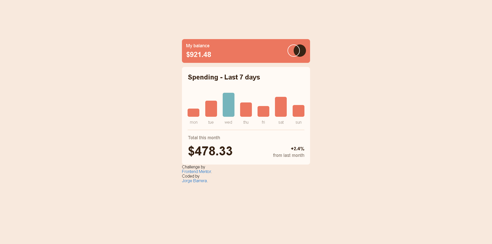
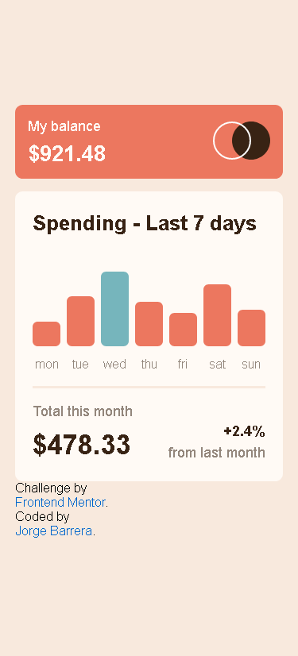

# Frontend Mentor - Expenses chart component solution

This is a solution to the [Expenses chart component challenge on Frontend Mentor](https://www.frontendmentor.io/challenges/expenses-chart-component-e7yJBUdjwt). 

## Table of contents

- [Overview](#overview)
  - [The challenge](#the-challenge)
  - [Screenshots](#screenshots)
  - [Links](#links)
- [My process](#my-process)
  - [Built with](#built-with)
  - [What I learned](#what-i-learned)
  - [Continued development](#continued-development)
- [Author](#author)

## Overview

### The challenge

Users should be able to:

- View the bar chart and hover over the individual bars to see the correct amounts for each day
- See the day with more money spended highlighted in a different colour to the other bars
- View the optimal layout for the content depending on their device’s screen size
- See hover states for all interactive elements on the page
- **Bonus**: Use the JSON data file provided to dynamically size the bars on the chart

### Screenshots





### Links

- Solution URL: [GitHub](https://github.com/BarreraJorgeL/expenses-chart-component)
- Live Site URL: [GitHub-Pages](https://barrerajorgel.github.io/expenses-chart-component/)

## My process

### Built with

- Semantic HTML5 markup
- CSS custom properties
- Flexbox
- Mobile-first workflow

### What I learned

Read data from an externar Json file with fetch.

```js
const DATA_URL = 'https://somewhere/someExample.json';

function getData(){
  return fetch(DATA_URL).then(response => response.json());
}
```

### Continued development

I'm still learnin how to control some errors that could appear while the program is running, like what happens if there's no data on the Json file for example.

## Author

- Frontend Mentor - [Jorge Luis](https://www.frontendmentor.io/profile/BarreraJorgeL)
- Twitter - [Jorge B.](https://twitter.com/Barrera_BRJL)
